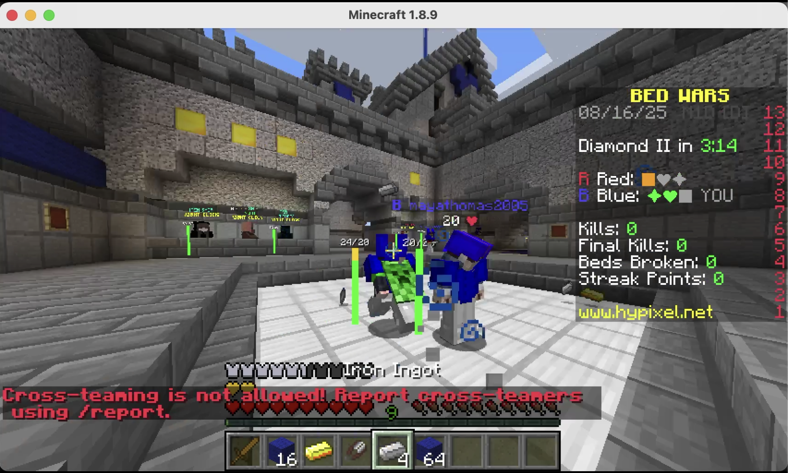

# HealthBarMod

A simple Minecraft mod that displays customizable health bars around player.

## Features

* Show health bars for other players (optionally yourself).
* Hide health bars when sneaking.
* Adjustable render distance, size, scale, and offset.
* Horizontal or vertical orientation.
* Dynamic color: green → yellow → red.

## Commands

`/healthbar <option>` — in-game control.

* `toggle` — Enable/disable health bars
* `self` — Show/hide your own health bar
* `sneak` — Hide when sneaking
* `distance <value>` — Set max render distance
* `scale <value>` — Adjust overall scale
* `barwidth <value>` — Set width
* `barheight <value>` — Set height
* `barmargin <value>` — Space between bar and name
* `xoffset <value>` / `yoffset <value>` / `zoffset <value>` — Adjust position
* `vertical` — Toggle vertical/horizontal display
* `reload` — Reload configuration

## Configuration

All options can be changed in `HealthBarMod.cfg` or via commands.

* `enabled`, `showSelf`, `hideWhenSneaking`, `vertical` — booleans
* `maxDistance`, `scale`, `barWidth`, `barHeight`, `barMargin`, `xOffset`, `yOffset`, `zOffset` — numbers

## Notes

[USE THIS MOD AT YOUR OWN RISK](https://support.hypixel.net/hc/en-us/articles/6472550754962-Hypixel-Allowed-Modifications)